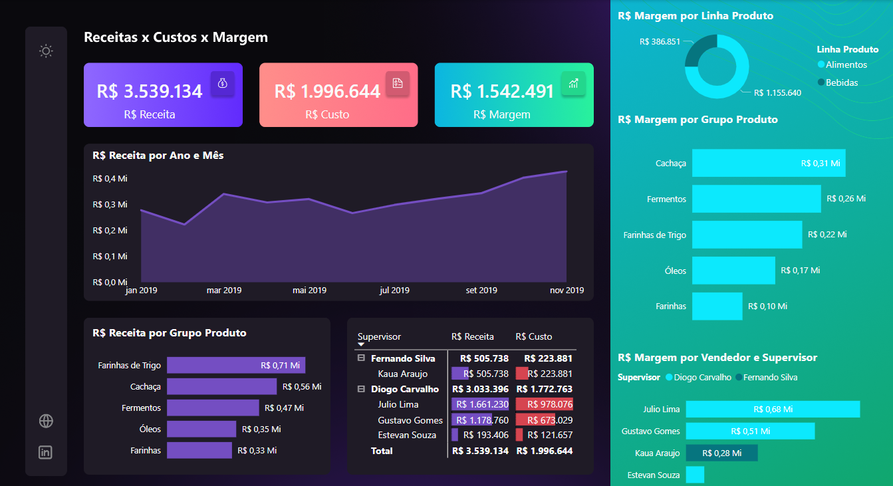
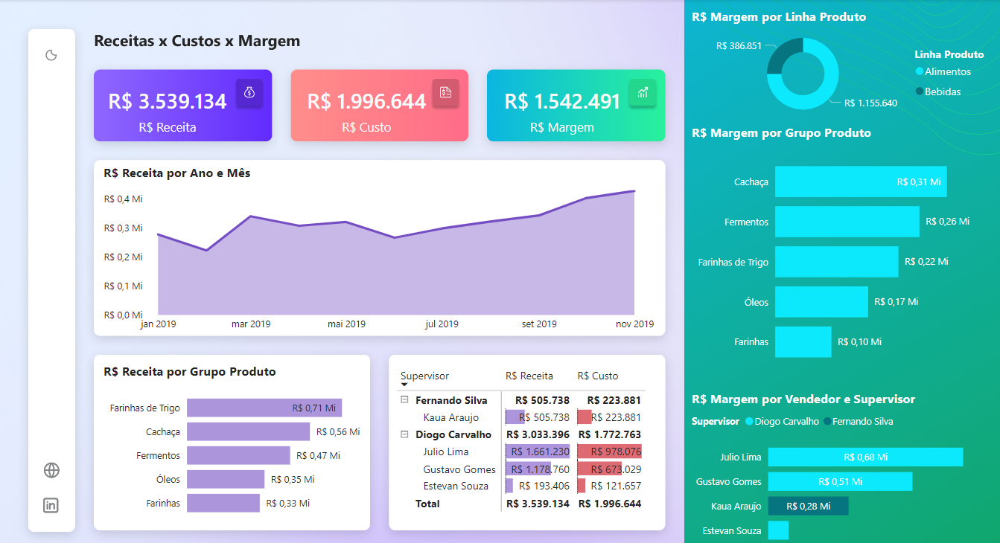

# Minicurso de Microsoft Power BI - Xperiun

Este repositório contém o projeto de estudo em **análise de dados** utilizando a ferramenta *Power BI* oferecido pela plataforma *Xperiun*.

## Dashboard

Prints do *dashboard* criado neste projeto:

## Estrutura do Projeto

* [**assets**](assets/): pasta contendo os arquivos auxiliares do projeto, como os temas e prints;
  * [**themes**](assets/themes/): pasta que contém os temas que podem ser utilizados no dashboard.

* [**data**](data/): pasta contendo planilhas *Excel* a serem utilizadas no *dashboard*;
* [*dashboard.pbix*](_): arquivo contendo o *dashboard* em *Power BI* salvo, com a versão Dark e Light;
* [*README.md*](_): arquivo de ajuda e orientação a respeito deste minicurso.
